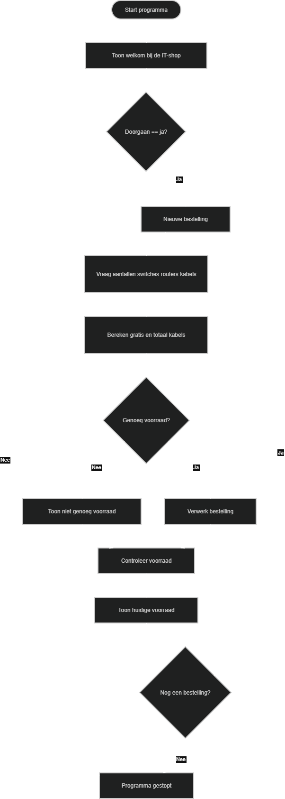

# IT-shop opdracht

Dit project is gemaakt voor school.

## Inhoud
- Python script voor een IT-shop
- Flowchart van het programma

## Wat doet het programma?
Het programma laat een gebruiker een bestelling doen met switches, routers en kabels.  
Het controleert of er genoeg voorraad is en geeft een melding als dat niet zo is.  
Ook wordt de voorraad automatisch bijgewerkt.

## Flowchart
Zie de afbeelding (dezelfde als in de repo)

## Gemaakt door
Donn Bleeker
